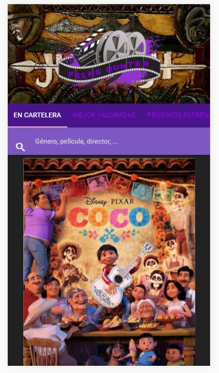
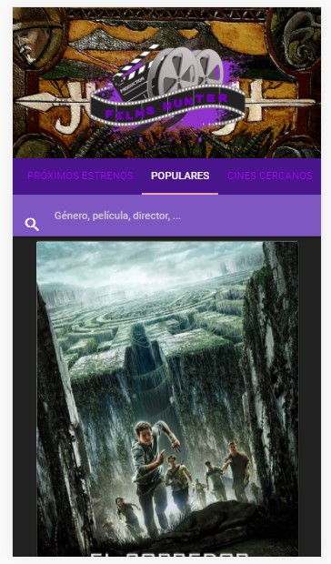
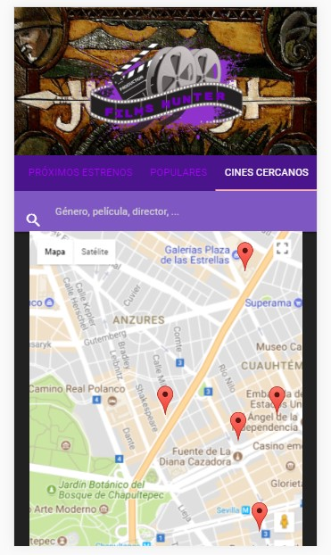
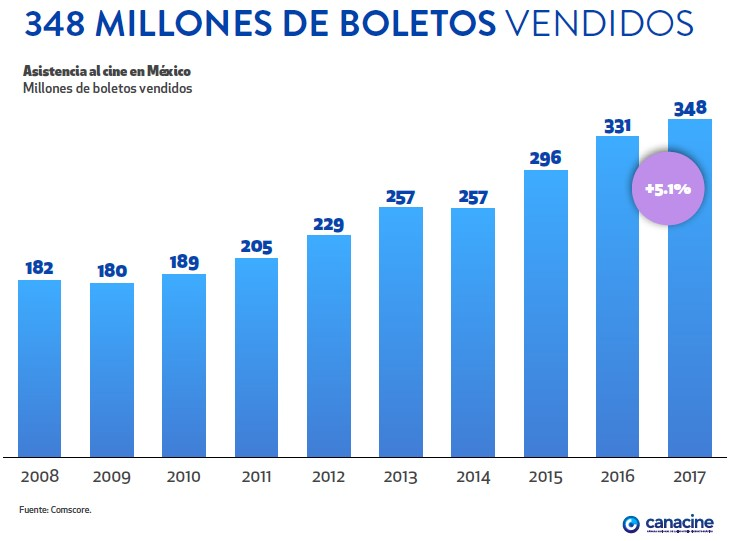
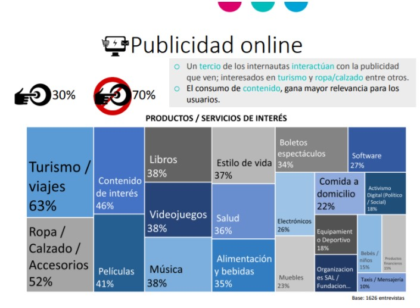
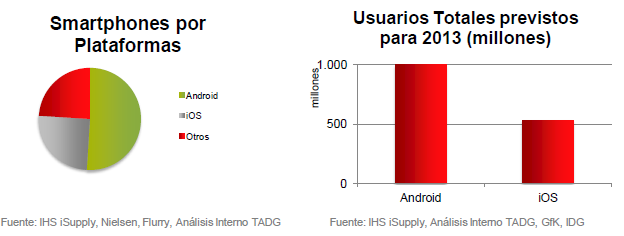
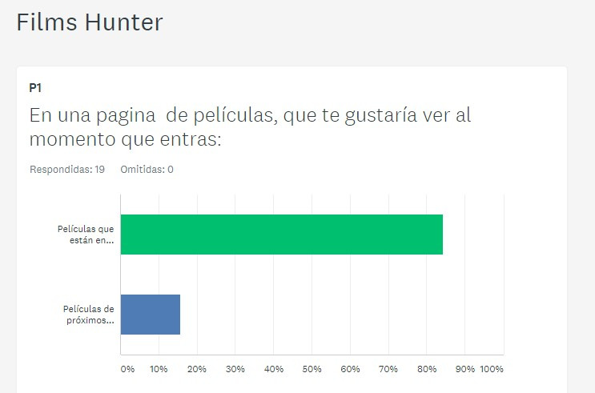
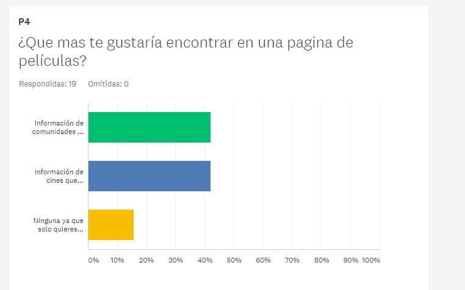
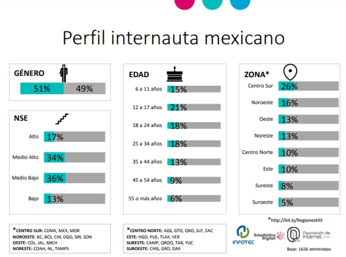

# F I L M S - H U NT E R

## Objetivo

    Aplicación móvil para cinéfilos y cazadores de películas.

  *  buscar películas
  *  leer la reseña
  *  mostrar los próximos estrenos

MARCA

CONTENIDO/ FUNCIONALIDADES

  El contenido consiste en los posters de las películas, sin limitarse a los que se encuentran en los streamings. Cada uno de estos posters ofrece su reseña. El menú de la app tiene 5 pestañas:

   * Películas en cartelera: contiene los posters de las películas que se encuentran en cartelera.

   * Las mejor valoradas: películas mejor valoradas por la crítica.

   * Próximos estrenos: las películas que están próximas a estrenarse.

   * Las más populares: películas con mejor rating por el público.

   * Cines cercanos: muestra el mapa con los cines que se encuentran más cerca de ti.

   MODELO DE NEGOCIO

   El modelo de negocio es In-App Advertising. La descarga de la app matriz es gratuita. Ofrece las películas en cartelera, las mejor valoradas, los próximos estrenos, las más populares y cines cercanos.
   Dejando espacio de publicidad para la industria cinematográfica como las casas productoras, las cadenas de cine, las plataformas de streaming y productos relacionados.

##  Organización

   Usando el método de scrum, partimos de un to do list, se repartieron las tareas y comenzamos el trabajo, revisando que se ha logrado y que está pendiente.

## Logros

  

  

  

  

  

## Lo que estamos usando

 Decidimos utilizar Materialize pues nos permite hacer una web-app y tener la vista Desktop y mobile.

 Las API que estamos usando es THE MOVIE DB (TMDb) y GOOGLE Maps Places.

## Desarrollo

 API THE MOVIE DB (TMDb), para usar su base de datos y extraer la información de la película, el póster y la reseña.

 API GOOGLE Maps Places, para obtener la ubicación del usuario y poder mostrarle cuáles son los cines cercanos a él.

## Flujo del programa

 Integrar la API THE MOVIE DB (TMDb), una vez generada la API Key, se extrae la data que se va a utilizar y se manipula dinámicamente a través del DOM.

 Integrar la API GOOGLE Maps Places, una vez generada la API Key, se genera el código para poder obtener las coordenadas del usuario y mostrar dinámicamente a través del DOM el mapa con los cines cercanos.

  

## Análisis del usuario

 VISIÓN DEL MERCADO GLOBAL

 Netflix domina el mercado mexicano: 72% de los usuarios de internet en México posee una cuenta de Netflix, esto significa que nuestro país es el mercado con más participación donde opera la compañía de transmisión de video por internet.

 Brasil se encuentra en segundo lugar, donde Netflix posee 67% del mercado; en Argentina controla 63%. En cuarto lugar aparece Estados Unidos, qye posee 62% y Canadá, 56%, de acuerdo con un análisis hecho por la firma de investigación Global Web Index.

 Nuestro país tiene 65.5 millones de internautas, una penetración de 63% de la población mexicana de 6 años en adelante, de acuerdo con el Instituto Nacional de Estadística y Geografía (Inegi) hasta 2016.

 Estos datos aparecen después de que en junio, Amazon extendiera su servicio de streaming, Prime Video, a todos los mercados del mundo por 2.99 dólares por los primeros seis meses.

 “Por mercado, Netflix tiene un firme posicionamiento en el continente americano”, agregó la firma.

 La proporción de mercado en cada región del mundo solo está empatada en Asía-Pacífico. En América Latina la proporción es de 68% versus 8% para la compañía de Jeff Bezos. En América del Norte la sombra de Netflix sobre sus competidores es de 61%.

 

 Cine en México

 La asistencia del público mexicano al cine aumentó con respecto al 2016.                                                 

 

 Las aplicaciones móviles van cobrando cada vez más protagonismo frente a la navegación en web desde PC o móviles. Pero este protagonismo no se refiere solo a la navegación sino, también, a los ingresos que genera la publicidad in-app. A medida que los anunciantes son más conscientes de los resultados, están re-asignando sus presupuestos en favor de las apps en busca del máximo retorno. Pero ésta no es la única razón: cada vez hay más usuarios que adoptan más dispositivos móviles y cada nuevo dispositivo representa una nueva oportunidad para generar ingresos. Esto es: el crecimiento de la adopción de dispositivos tiene un impacto directo en el crecimiento de la oportunidad de monetización.

 En función del objetivo que cada desarrollador se haya marcado, se suele elegir el modelo de negocio más adecuado. Precisamente el modelo de negocio, junto a la elección adecuada del target, son factores esenciales para el éxito de una aplicación. Los modelos de negocio de las apps en los que suelen trabajar los desarrolladores son:

  * Free: todo gratis (no hay pago por descarga y todas las funcionalidades están disponibles. Suele tener como objetivo branding o generación de bases de usuarios).
  *	Freemium: descarga gratis con compras dentro de la aplicación.
  *	Paid: pago por descarga pero no hay compras in-app.
  *	Paidmium: pago por descarga y con compras in-app.
  *	In-App Advertising: App gratis que contiene publicidad (banners, vídeo…).
  *	Dynamic: modelo de negocio que cambia en función de una serie de factores (por ejemplo, la app puede cambiar y pasar de ser 100% gratuita a incluir publicidad en el caso de que el usuario no realice ninguna compra in-app).

 

 En el ecosistema móvil, las aplicaciones representan actualmente la segunda mayor fuente de ingresos por detrás del consumo de datos, tanto por pago de contenidos como por publicidad. El informe muestra que entre agosto y septiembre las descargas de aplicaciones móviles en las tiendas iOS y Google Play llegaron a 26.000 millones en todo el mundo, lo que supone un crecimiento del 8%. En términos de ingresos los resultados también fueron muy positivos para el mercado de aplicaciones, ya que en el tercer trimestre del año alcanzaron los US$17.000 millones, lo que representa un crecimiento anual del 28%.

 Además, destaca que el tiempo dedicado a las aplicaciones móviles también crece. En el caso de los teléfonos con el sistema operativo Android creció un 40% año contra año, acercándose a las 325.000 millones de horas en el tercer trimestre de 2017.
    “El crecimiento en términos de descargas y uso, demuestra que las aplicaciones se están convirtiendo cada vez más en el centro de la vida de las personas. Este valor se está traduciendo en un aumento de los ingresos para la industria”, dice el informe.

 

 SMARTPHONES

 El reporte dice que, al igual que en trimestre anteriores, Google Play mantuvo una ventaja sobre iOS en descargas.

 La brecha entre ambas plataformas se amplió a 125% en el tercer trimestre de este año frente al 115% registrado en el mismo período de 2016. Dicho resultado responde, en parte, a la dinámica de los mercados emergentes.

 Las ventas de smartphones de plataforma Android alcanzarán en 2013 los 1.000 millones de dispositivos mientras que iOS habrá vendido 527 millones de smartphones para finales de 2013.

 La investigación concluye que el mercado de aplicaciones llegará a 240.000 millones de descargas, a la vez que sus ingresos llegarán a los US$100.000 millones en el año 2021 en iOS y Google Play en conjunto.

 

 Films hunter es un app que mantiene al público informado respecto los próximos estrenos, las películas que se encuentran en cartelera y recomendaciones de la comunidad que gusta del cine.

 Revisando las estadísticas y realizando encuestas nos dimos cuenta de la necesidad del público por estar al tanto de los próximos estrenos, ya que es común ver algún corto e interesarse por la película, pero después no asistir a verla porque no se enteraron cuando se estrenó e incluso olvidaron el nombre de la película.

 Se volvió a encuestar al público en base a lo que nos habían solicitado y eso nos permitió desarrollar el diseño del PMV.
 Estos fueron los resultados de la segunda encuesta:

 

 

 

 

 

